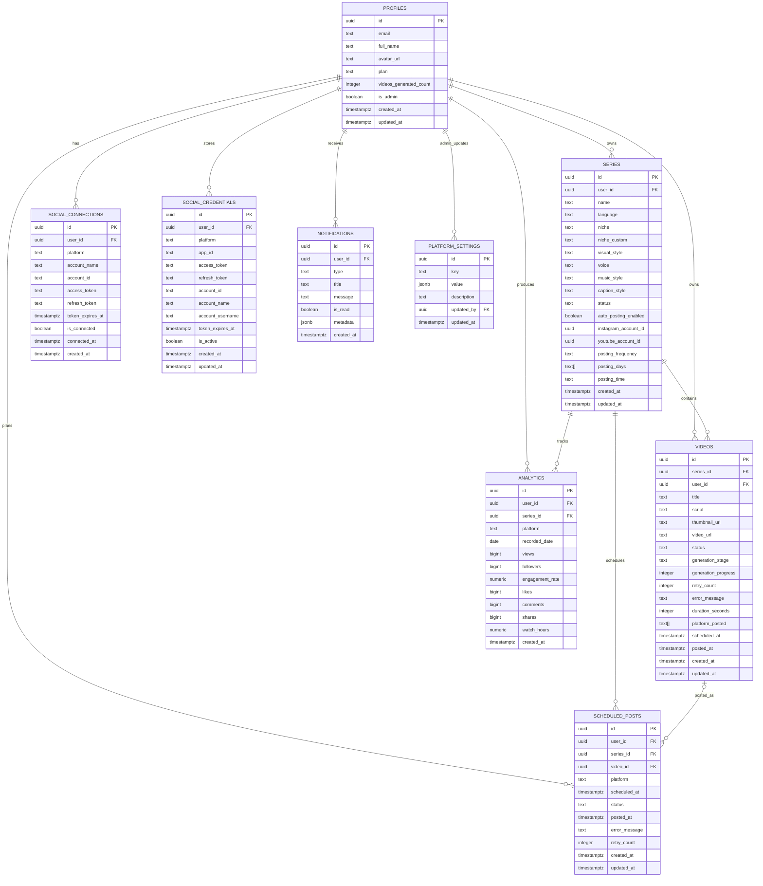

# Entity Relationship (ER) Diagram — Faceless Video Platform

This document maps the Supabase Postgres database tables, their primary fields, relationships, and cardinality. Mermaid ER diagrams are included for visual reference.

---

## 1. ER Diagram — Logical View

---

## 2. Cardinality Reference

| Parent Entity | Child Entity | Relationship | Notes |
|---------------|--------------|--------------|-------|
| `profiles` | `series` | 1 : N | One user can own many series. |
| `profiles` | `videos` | 1 : N | One user can own many videos. |
| `series` | `videos` | 1 : N | One series contains many videos. |
| `profiles` | `social_connections` | 1 : N | One user can have multiple platform connections. |
| `profiles` | `social_credentials` | 1 : N | One user can store OAuth credentials per platform. |
| `profiles` | `analytics` | 1 : N | Daily metrics per user per platform. |
| `series` | `analytics` | 1 : N | Series-level metrics (nullable). |
| `profiles` | `scheduled_posts` | 1 : N | A user creates many scheduled posts. |
| `series` | `scheduled_posts` | 1 : N | A series drives many scheduled posts. |
| `videos` | `scheduled_posts` | 0..1 : N | A video may be posted multiple times (or none). |
| `profiles` | `notifications` | 1 : N | One user receives many notifications. |
| `profiles` | `platform_settings` | 0..1 : N | Only admin users update platform settings. |

---

## 3. Entity Descriptions

### 3.1 `profiles`
Extends `auth.users`. Stores plan tier, usage counter, admin flag, and basic profile data.

- **Primary key:** `id` (references `auth.users.id`).
- **Constraints:** `plan IN ('beginner', 'daily', 'pro')`.

### 3.2 `series`
A content theme or channel series. Holds language, niche, visual/voice/music/caption preferences, and posting schedule.

- **Primary key:** `id`.
- **Foreign keys:** `user_id -> profiles(id)`.
- **Constraints:** `status IN ('active', 'paused', 'archived')`; `posting_frequency IN ('3x_week', 'daily', 'pro')`.

### 3.3 `videos`
Represents a generated or uploaded video asset. Tracks generation status, progress, errors, and final URLs.

- **Primary key:** `id`.
- **Foreign keys:** `series_id -> series(id)`; `user_id -> profiles(id)`.
- **Constraints:** `status IN ('queued', 'generating_script', 'generating_visuals', 'generating_video', 'ready', 'posted', 'failed', 'scheduled')`.

### 3.4 `social_connections`
Human-readable social account links per user/platform.

- **Primary key:** `id`.
- **Foreign key:** `user_id -> profiles(id)`.
- **Unique:** `(user_id, platform, account_id)`.

### 3.5 `social_credentials`
Secure storage for OAuth tokens used by posting integrations.

- **Primary key:** `id`.
- **Foreign key:** `user_id -> profiles(id)`.
- **Unique:** `(user_id, platform)`.

### 3.6 `analytics`
Daily snapshot of platform metrics (views, followers, engagement, etc.).

- **Primary key:** `id`.
- **Foreign keys:** `user_id -> profiles(id)`; `series_id -> series(id)` (nullable).
- **Unique:** `(user_id, series_id, platform, recorded_date)`.

### 3.7 `scheduled_posts`
Planned publishing events linking a series and optionally a video to a platform and time.

- **Primary key:** `id`.
- **Foreign keys:** `user_id -> profiles(id)`; `series_id -> series(id)`; `video_id -> videos(id)` (nullable).
- **Constraints:** `status IN ('pending', 'posting', 'posted', 'failed', 'cancelled')`.

### 3.8 `notifications`
User-facing alerts generated by the system.

- **Primary key:** `id`.
- **Foreign key:** `user_id -> profiles(id)`.
- **Constraints:** `type IN ('video_ready', 'video_failed', 'post_success', 'post_failed', 'monetization_alert', 'plan_limit')`.

### 3.9 `platform_settings`
Global configuration managed by admin users (plans, pricing, timeouts, supported languages, maintenance mode).

- **Primary key:** `id`.
- **Foreign key:** `updated_by -> profiles(id)` (nullable).
- **Unique:** `key`.

---

## 4. Storage Bucket

| Bucket | Visibility | Purpose |
|--------|------------|---------|
| `generated-media` | Public read | Stores generated MP4/WebM videos and PNG/JPEG/WebP images. |

RLS policies restrict insert/delete to authenticated users and service roles.

---

## 5. Key Indexes & Constraints

- `profiles.id` references `auth.users(id) ON DELETE CASCADE`.
- `series.user_id` references `profiles(id) ON DELETE CASCADE`.
- `videos.series_id` references `series(id) ON DELETE CASCADE`.
- `videos.user_id` references `profiles(id) ON DELETE CASCADE`.
- `scheduled_posts.video_id` references `videos(id) ON DELETE SET NULL` to preserve scheduling history.
- `analytics.series_id` references `series(id) ON DELETE SET NULL` to keep user analytics when a series is removed.
