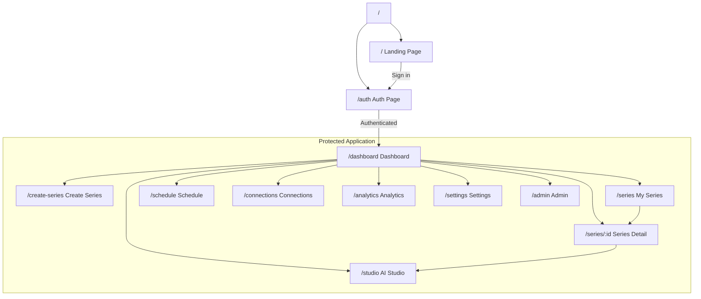
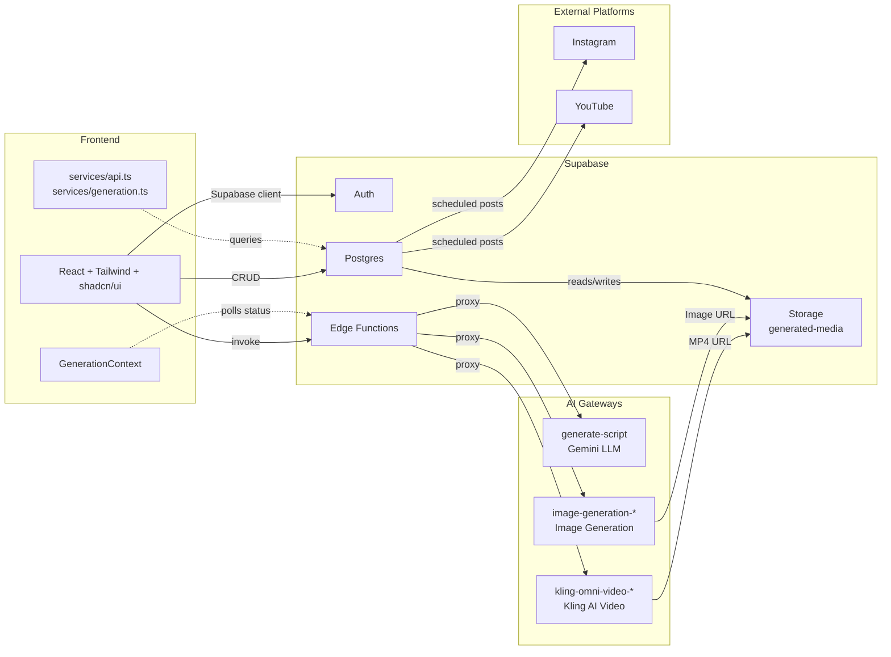
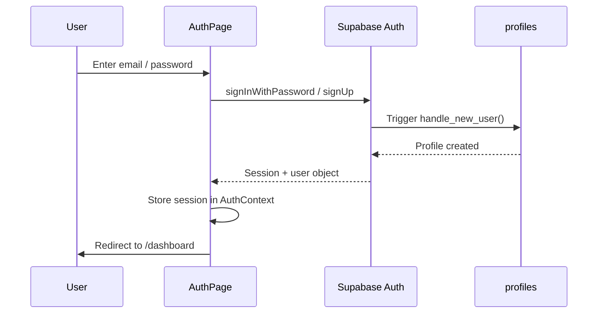
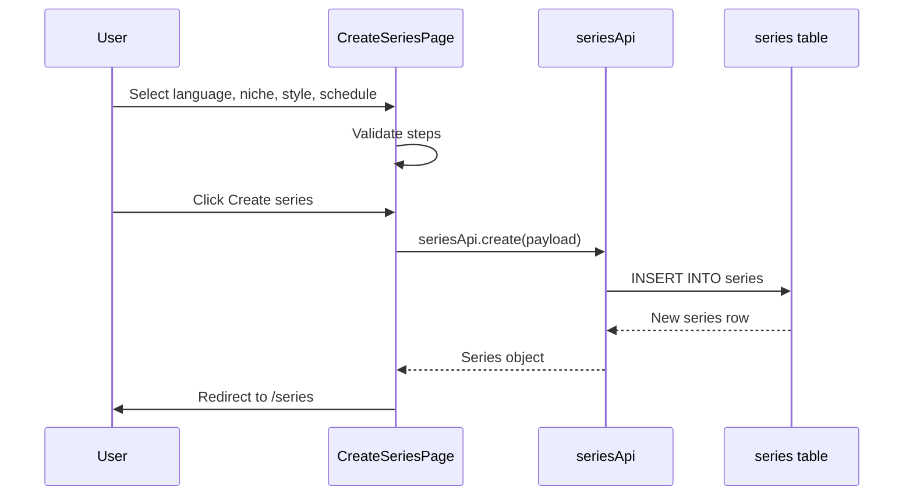
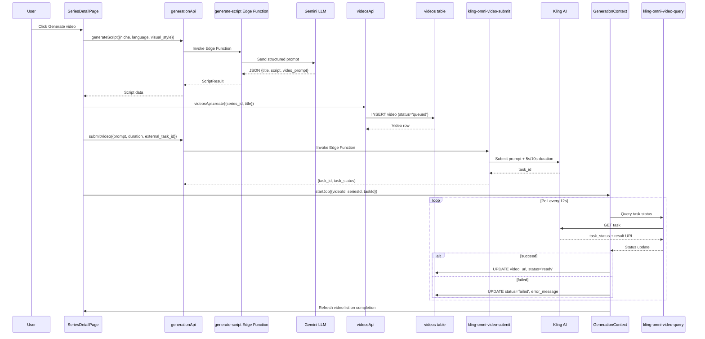
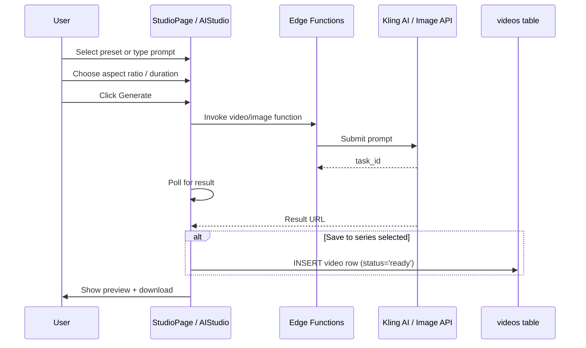
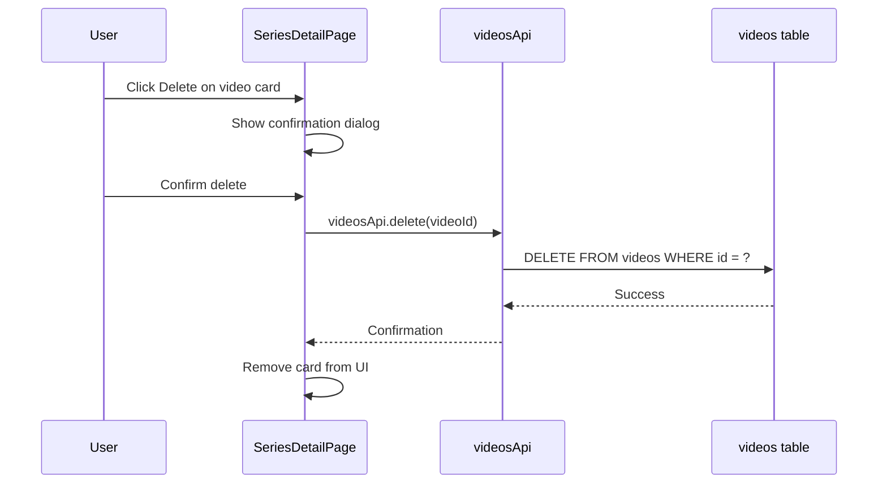
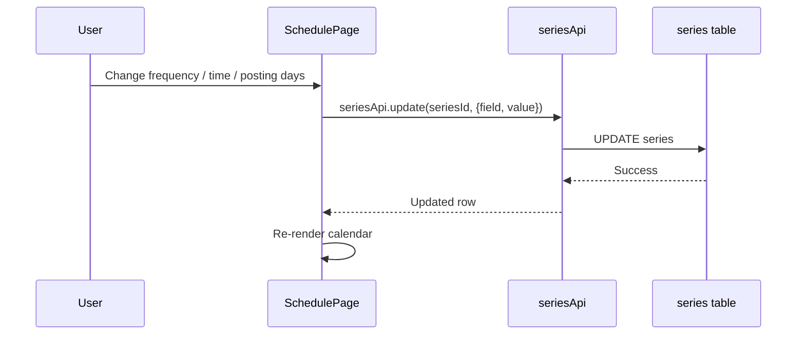
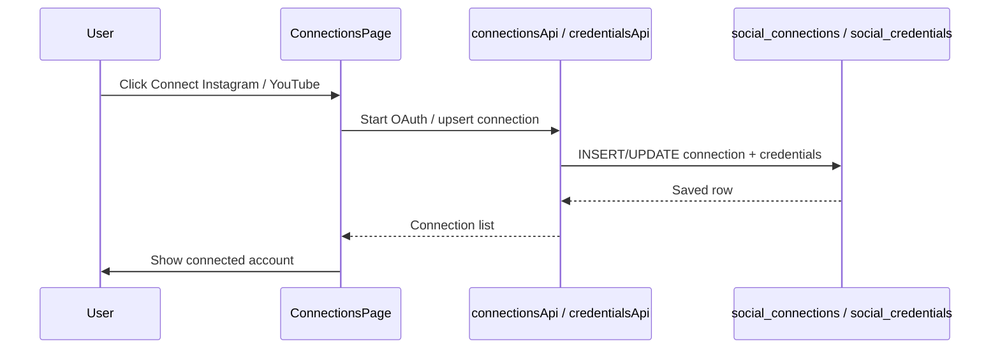
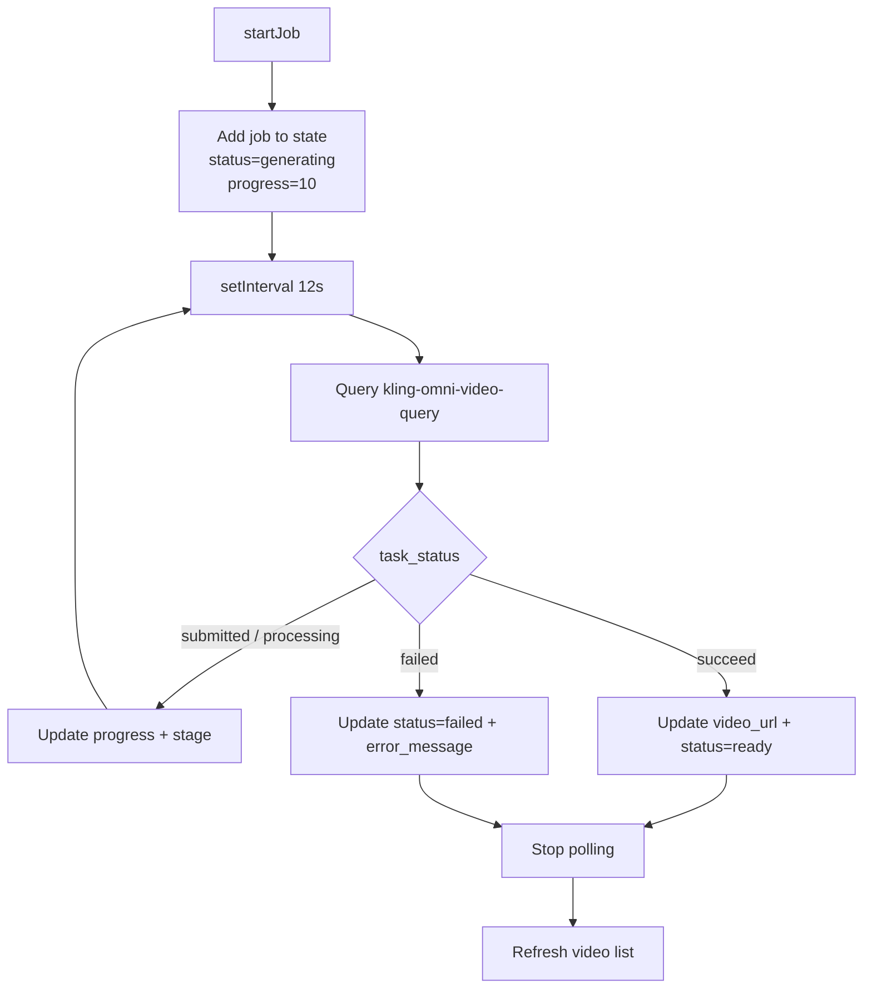

# Site Map & Data Flow — Faceless Video Platform

This document defines the application pages, routes, user flows, and the movement of data between the React frontend, Supabase backend, AI gateways, and storage.

---

## 1. Site Map

### 1.1 Page Hierarchy

### 1.2 Route Reference

| Route | Page | Visibility | Purpose |
|-------|------|------------|---------|
| `/` | `LandingPage` | Public | Marketing / product overview |
| `/auth` | `AuthPage` | Public | Sign up / sign in (Supabase Auth) |
| `/dashboard` | `DashboardPage` | Protected | Overview stats, active series, recent videos |
| `/create-series` | `CreateSeriesPage` | Protected | Multi-step series creation wizard |
| `/series` | `SeriesPage` | Protected | List, pause/resume, archive series |
| `/series/:id` | `SeriesDetailPage` | Protected | Generate videos, view series videos, delete videos, toggle auto-posting |
| `/studio` | `StudioPage` | Protected | AI Studio for ad-hoc video/image generation |
| `/schedule` | `SchedulePage` | Protected | Per-series posting schedule + 30-day calendar |
| `/connections` | `ConnectionsPage` | Protected | Connect Instagram / YouTube accounts |
| `/analytics` | `AnalyticsPage` | Protected | View growth metrics and engagement charts |
| `/settings` | `SettingsPage` | Protected | User profile and account settings |
| `/admin` | `AdminPage` | Protected (admin only) | Platform settings and admin controls |

---

## 2. Data Flow Overview

### 2.1 High-Level Architecture

---

## 3. User Flows & Data Flows

### 3.1 Authentication Flow

### 3.2 Create Series Flow

### 3.3 Generate Video Flow

### 3.4 AI Studio Flow

### 3.5 Delete Video Flow

### 3.6 Schedule Flow

### 3.7 Connections Flow

---

## 4. Data Sources per Page

| Page | Reads From | Writes To | Key Interactions |
|------|------------|-----------|------------------|
| Dashboard | `profiles`, `series`, `videos`, `social_connections` | `analytics` (demo seed) | Stats cards, recent videos, active series |
| Create Series | constants/types | `series` | Multi-step form |
| My Series | `series` | `series` (status update, archive) | List + actions |
| Series Detail | `series`, `videos` | `videos`, `series` (auto-post toggle) | Generate, preview, delete, retry |
| AI Studio | `series` (selector) | `videos` (optional save) | Edge function video/image generation |
| Schedule | `series`, `scheduled_posts` | `series`, `scheduled_posts` | Calendar + posting settings |
| Connections | `social_connections` | `social_connections`, `social_credentials` | OAuth linking |
| Analytics | `analytics` | — | Charts and metrics |
| Settings | `profiles` | `profiles` | Profile update |
| Admin | `platform_settings`, `profiles` | `platform_settings` | Admin-only configuration |

---

## 5. Edge Function Call Map

| Edge Function | Called From | Purpose | Upstream |
|---------------|-------------|---------|----------|
| `generate-script` | `SeriesDetailPage`, `services/generation.ts` | Create title, script, and cinematic video prompt | Gemini LLM gateway |
| `kling-omni-video-submit` | `SeriesDetailPage`, `AIStudio` | Submit video prompt and receive task ID | Kling AI |
| `kling-omni-video-query` | `GenerationContext`, `AIStudio` | Poll task status and fetch result URL | Kling AI |
| `image-generation-submit` | `AIStudio` | Submit image prompt | Image generation gateway |
| `image-generation-query` | `AIStudio` | Poll image task status | Image generation gateway |
| `large-language-model` | (generic) | Generic LLM passthrough | Gemini LLM gateway |

---

## 6. Background Job Architecture

`GenerationContext` maintains an in-memory list of generation jobs and polls the upstream every 12 seconds.

---

## 7. Notable Data Rules

- **Language enforcement:** `generate-script` instructs the LLM to produce `title`, `script`, and `keywords` in the series language; `video_prompt` is always in English for the Kling AI model.
- **Duration clamping:** Only `5` and `10` second durations are accepted by Kling; invalid values are clamped server-side.
- **RLS:** All tables use Row Level Security; users can only access their own records except for public storage reads and admin-managed `platform_settings`.
- **Cascade deletes:** Deleting a profile cascades to `series`, `videos`, `social_connections`, etc. Deleting a series cascades to its videos. Deleting a video sets related `scheduled_posts.video_id` to `NULL`.
